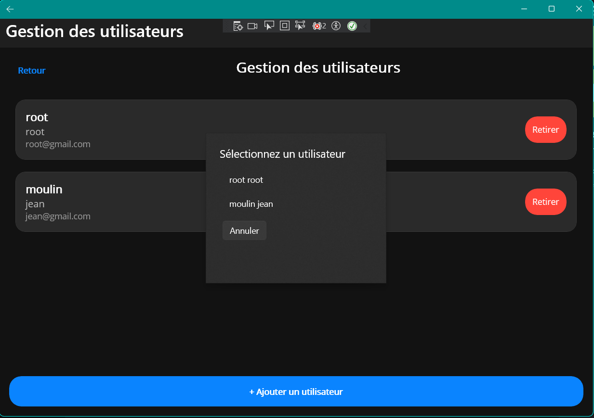

# TaskMaster
##### [GitHub Project](https://github.com/users/Ikanaa/projects/1)
##### [GitHub Repo](https://github.com/Ikanaa/TaskMaster)

# Prérequis

- Vous pouvez lancer la base de donner MariaDB grâce a la commande :
```bash
docker-compose up
```

# Guide d'utilisation

#### Connection / Inscription

Pour commencer, lorsque vous allez ouvrir pour la première fois l'application, vous allez pouvoir vous incrire.

Sinon, si vous avez déjà un compte, vous pouvez cliquer sur *Se connecter* pour accéder à la page de connexion.


#### Page principale

Vous aurez alors devant vous le gestionnaire de tâche


#### Projet

Les tâches sont organisées par projet, vous pouvez accéder au gestionnaire de projet avec le bouton *Gérer les projets* depuis le menu principal.

Vous pouvez ajouter de nouveau projet avec le bouton *Nouveau Projet*

Chaque tâche est rangée dans un projet, seuls les utilisateurs ajoutés au projet peuvent voir les tâches.
Vous pouvez gérer les utilisateurs du projet en cliquant sur *Utilisateur*

Vous pouvez ajouter un utilisateur au projet avec le bouton *Ajouter un utilisateur*


#### Tâche

Vous pouvez ajouter une nouvelle tâche avec le bouton *nouvelle tâche* depuis le menu principal.


Vous pouvez supprimer une tâche avec le bouton *Supprimer* associé à la tâche.
Vous pouvez modifier une tâche avec le bouton *Modifier* associé à la tâche.


En cliquant simplement sur la tâche, vous pourrez voir les détails de celle-ci.

