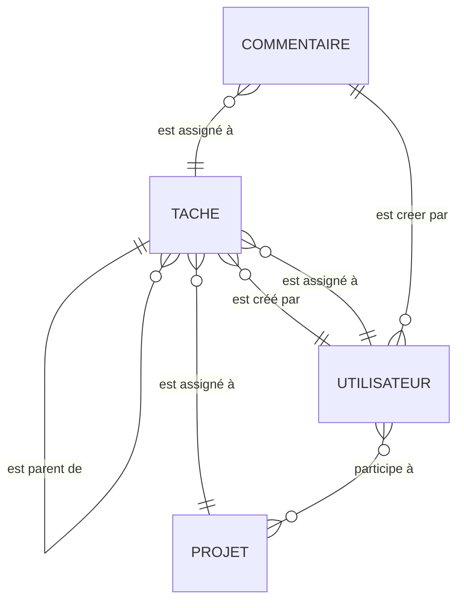
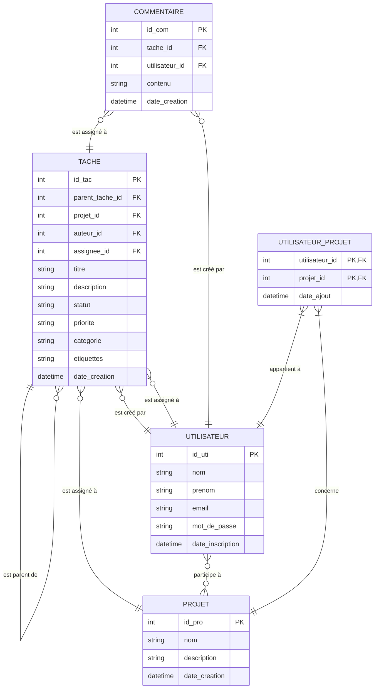

# TEXTUEL

[tache, projet, utilisateur, commentaire]

- une tache est assigné a un projet
- une tache est créé par un utilisateur
- une tache est assigné a un utilisateur
- un utilisateur participe a un ou plusieur projet
- un commentaire est assigné a une tache
- un commentaire est créé par un utilisateur
- une tache peut être une sous tache est être enfant d'une tache
---
# MCD

---
# MLD

---
# SQL

```sql
-- Drop database if it exists and create a new one
DROP DATABASE IF EXISTS taskmaster;
CREATE DATABASE taskmaster;
USE taskmaster;

-- Drop tables if they exist (in reverse order of dependency)
DROP TABLE IF EXISTS UTILISATEUR_PROJET;
DROP TABLE IF EXISTS COMMENTAIRE;
DROP TABLE IF EXISTS TACHE;
DROP TABLE IF EXISTS PROJET;
DROP TABLE IF EXISTS UTILISATEUR;

-- Create UTILISATEUR table
CREATE TABLE UTILISATEUR (
    id_uti INT AUTO_INCREMENT PRIMARY KEY,
    nom VARCHAR(100) NOT NULL,
    prenom VARCHAR(100) NOT NULL,
    email VARCHAR(100) NOT NULL UNIQUE,
    mot_de_passe VARCHAR(255) NOT NULL,
    date_inscription DATETIME DEFAULT CURRENT_TIMESTAMP
) ENGINE=InnoDB;

-- Create PROJET table
CREATE TABLE PROJET (
    id_pro INT AUTO_INCREMENT PRIMARY KEY,
    nom VARCHAR(100) NOT NULL,
    description TEXT,
    date_creation DATETIME DEFAULT CURRENT_TIMESTAMP
) ENGINE=InnoDB;

-- Create TACHE table
CREATE TABLE TACHE (
    id_tac INT AUTO_INCREMENT PRIMARY KEY,
    parent_tache_id INT,
    projet_id INT NOT NULL,
    auteur_id INT NOT NULL,
    assignee_id INT,
    titre VARCHAR(100) NOT NULL,
    description TEXT,
    statut VARCHAR(50) DEFAULT 'À faire',
    priorite VARCHAR(50) DEFAULT 'Normal',
    categorie VARCHAR(50),
    etiquettes VARCHAR(255),
    date_creation DATETIME DEFAULT CURRENT_TIMESTAMP,
    FOREIGN KEY (parent_tache_id) REFERENCES TACHE(id_tac) ON DELETE SET NULL ON UPDATE CASCADE,
    FOREIGN KEY (projet_id) REFERENCES PROJET(id_pro) ON DELETE CASCADE ON UPDATE CASCADE,
    FOREIGN KEY (auteur_id) REFERENCES UTILISATEUR(id_uti) ON DELETE RESTRICT ON UPDATE CASCADE,
    FOREIGN KEY (assignee_id) REFERENCES UTILISATEUR(id_uti) ON DELETE SET NULL ON UPDATE CASCADE
) ENGINE=InnoDB;

-- Create COMMENTAIRE table
CREATE TABLE COMMENTAIRE (
    id_com INT AUTO_INCREMENT PRIMARY KEY,
    tache_id INT NOT NULL,
    utilisateur_id INT NOT NULL,
    contenu TEXT NOT NULL,
    date_creation DATETIME DEFAULT CURRENT_TIMESTAMP,
    FOREIGN KEY (tache_id) REFERENCES TACHE(id_tac) ON DELETE CASCADE ON UPDATE CASCADE,
    FOREIGN KEY (utilisateur_id) REFERENCES UTILISATEUR(id_uti) ON DELETE CASCADE ON UPDATE CASCADE
) ENGINE=InnoDB;

-- Create UTILISATEUR_PROJET table (junction table)
CREATE TABLE UTILISATEUR_PROJET (
    utilisateur_id INT NOT NULL,
    projet_id INT NOT NULL,
    date_ajout DATETIME DEFAULT CURRENT_TIMESTAMP,
    PRIMARY KEY (utilisateur_id, projet_id),
    FOREIGN KEY (utilisateur_id) REFERENCES UTILISATEUR(id_uti) ON DELETE CASCADE ON UPDATE CASCADE,
    FOREIGN KEY (projet_id) REFERENCES PROJET(id_pro) ON DELETE CASCADE ON UPDATE CASCADE
) ENGINE=InnoDB;
```