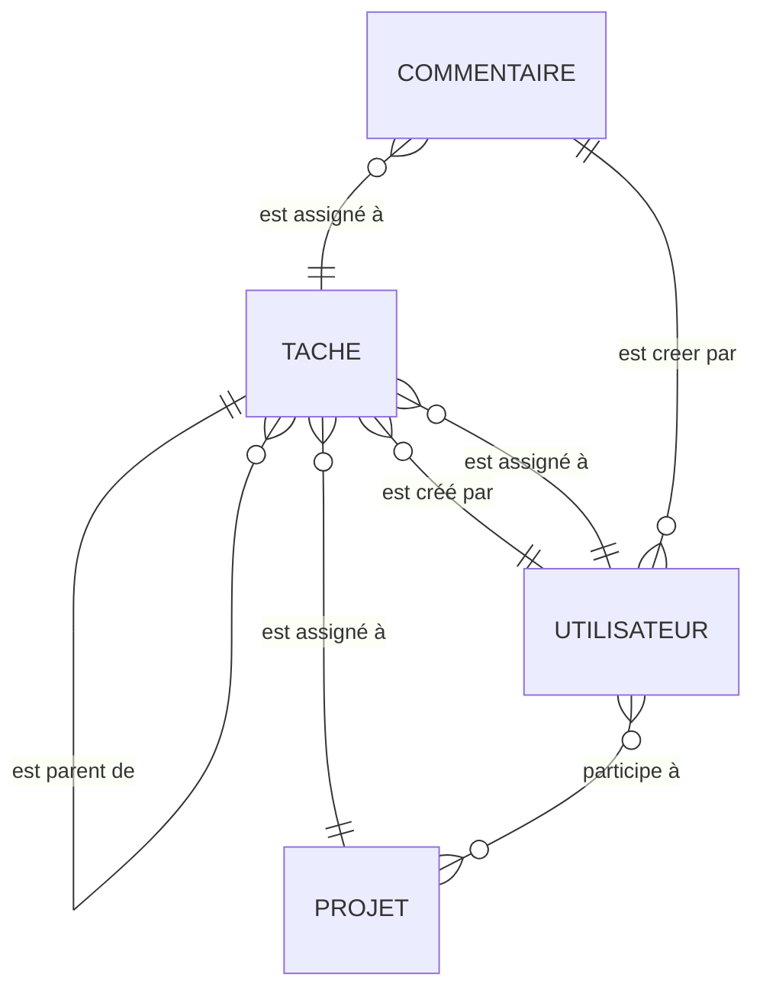
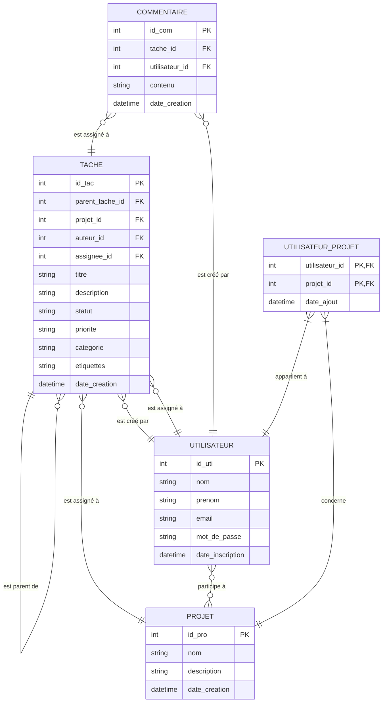

# TEXTUEL

[tache, projet, utilisateur, commentaire]

- une tache est assigné a un projet
- une tache est créé par un utilisateur
- une tache est assigné a un utilisateur
- un utilisateur participe a un ou plusieur projet
- un commentaire est assigné a une tache
- un commentaire est créé par un utilisateur
- une tache peut être une sous tache est être enfant d'une tache
---
# MCD

---
# MLD
